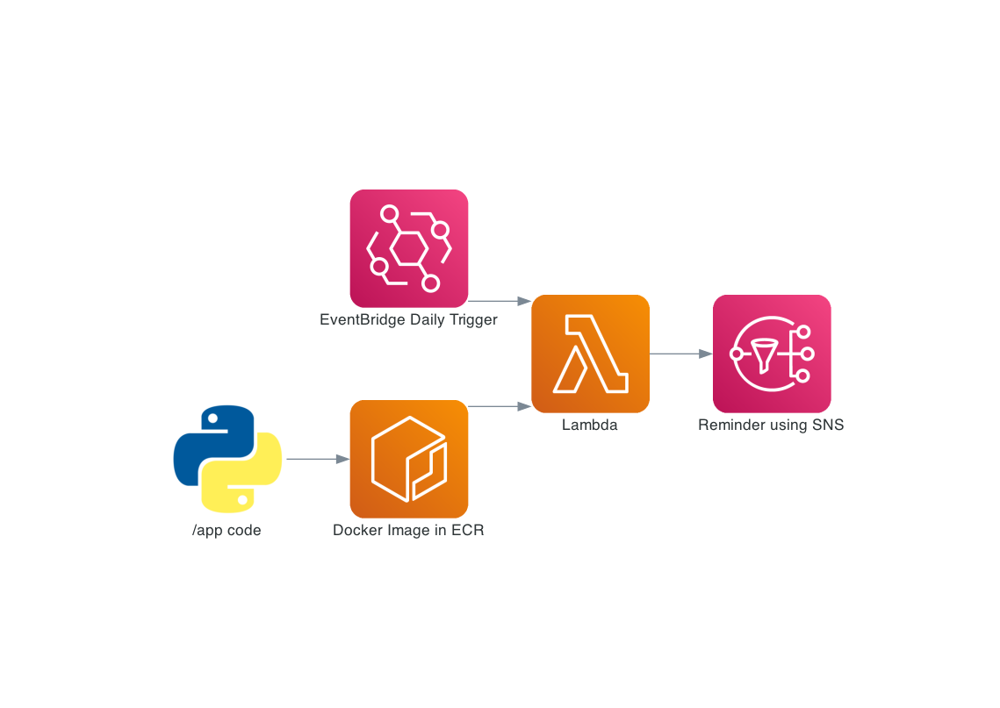

Typically people use a social media website such as Facebook to remember their friend's birthdays... however this repo can be used as alternative! Given a set of names and their birthdays, this gives AWS a set of instructions to give you a text reminder the day before and the month before someone's birthday. 

The architecture used in AWS is shown below. Lambda is used to run the code using an image stored in ECR. It is scheduled to run daily by EventBridge.

## Prerequisites

To use the following repo you will need to do the following:

1) Set up an AWS account and set up the AWS CLI on your local machine 
2) Create an IAM role which has Cloudwatch and SNS permissions. The Cloudwatch permissions allow you to execute the code within a lambda and the SNS is required to send the text message. The IAM role is used with the Docker image to give the correct permissions. https://docs.aws.amazon.com/IAM/latest/UserGuide/id_roles_create.html 
3) Create an SNS Topic, add the phone numbers to the topic who will recieve the reminders and identify the Topic ARN - https://docs.aws.amazon.com/sns/latest/dg/sns-configuring.html
4) Download Docker to your local machine - https://docs.docker.com/get-docker/ 
5) Install poetry - https://python-poetry.org/docs/

## To use

To use the repo you will need to update the following:

- *{ACCOUNT_NUMBER}* - your AWS account number
- *{REGION}* - the AWS region you want to use for resources
- *{contacts.py}* - the names and birthdays you want reminders for
- *{IAM_ROLE_ARN}* - the ARN for the IAM Role created 

Once these are updated follow the steps below:

1) `make up` - this builds the Docker image
2) `make get_image_id` - identify the 'IMAGE ID' associated the the repository 'app'
3) `make ecr_login`, `make create_ecr` - creates the repository for the image in ECR
4) Update the `push_to_ecr` command in the make file with the IMAGE ID identified in Step 2
5) `make push_to_ecr` - pushes the image built in Step 1 in ECR
6) `create_lambda_function` - creates lambda function with Docker Image
7) `create_daily_rule` - creates rule in EventBridge to schedule the lambda function
8)  Manually add the EventBridge trigger to the Lambda in the AWS Console to run the code once a day at noon